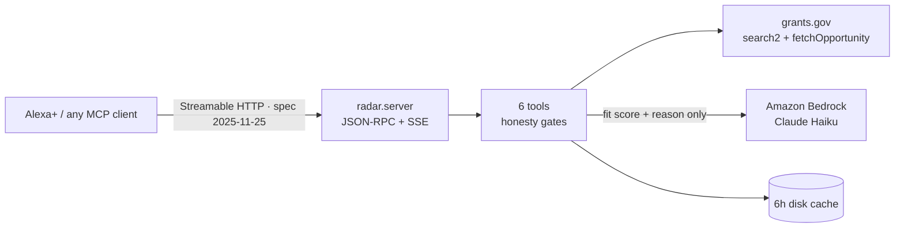

# Opportunity Radar 📡

**Ask out loud what public funding you can actually apply for — and get an answer with real numbers, or none at all.**

Every year billions in public grant funding goes unclaimed, not because people
are unqualified but because nobody has time to read `grants.gov` on a Tuesday
night. Opportunity Radar is a self-hosted **MCP server** that turns that
database into something you can ask a question to: *"any grants open for a
small AI company?"*, *"what closes in the next two weeks?"*, *"am I even
allowed to apply for that one?"*

Because Alexa+ speaks MCP, the same server answers in the kitchen.

> Built for the **Build, Ship, Shape: Amazon Developer Hackathon** — Alexa+ track,
> with the **AWS Builder** and **Open Source** mini challenges.

## What makes it different: it refuses to guess

A funding answer that is confidently wrong costs someone a weekend. So the
honesty rules are structural, not prompt-deep:

| Failure mode | What this server does |
|---|---|
| Source down | Returns `error: source_unavailable` + "I have no numbers for you" — never an estimate |
| Notice publishes no applicant list | Reports `status: see_notice`, **not** "you're ineligible" |
| Opportunity has no deadline | Counted and reported separately, never silently dropped |
| Model ranks fit | Model may set **score and reason only**; deadlines and dollar figures are attached from grants.gov afterwards |

The test suite asserts each of those (`tests/test_radar.py::HonestyUnderFailure`).

## Tools

| Tool | Question it answers |
|---|---|
| `find_opportunities` | "What's open for rural health right now?" |
| `opportunity_detail` | "How much is it, and who runs it?" |
| `check_eligibility_fit` | "Can an individual apply, or only universities?" |
| `deadline_watch` | "What do I have to act on this week?" |
| `weekly_briefing` | The scheduled Monday sweep across all your interests |
| `rank_for_me` | "Of these, which are actually worth my Saturday?" (Bedrock) |

## Run it

```bash
git clone https://github.com/kevin9327/opportunity-radar && cd opportunity-radar
python -m radar.server              # http://0.0.0.0:8080/mcp
```

No API key is needed: `grants.gov` search is public. Responses cache for 6h.

```bash
# point any MCP client at it
curl -s localhost:8080/mcp -H 'content-type: application/json' \
  -d '{"jsonrpc":"2.0","id":1,"method":"tools/call","params":{"name":"deadline_watch","arguments":{"interest":"artificial intelligence","within_days":30}}}'
```

### Fit ranking runs on your own machine

`rank_for_me` asks a model whether each opening is worth your Saturday. It
prefers a **local model over Ollama** — no key, no account, and the sentence
describing your situation never leaves the house. That matters when the query
is *"grants for a family caring for a disabled child"*.

```bash
ollama pull llama3.1:8b      # engine: local
```

Fallbacks are automatic and always labelled in the response: Amazon Bedrock if
AWS credentials happen to exist, then plain keyword overlap so the radar still
answers offline. Set `RADAR_RANK_ENGINE=local|bedrock|overlap` to pin one.

## How it fits together



`radar/server.py` implements the transport by hand against the MCP spec — one
endpoint, `initialize` handing out a session id, `tools/list` schemas generated
from Python type hints, `tools/call` returning both spoken text and
`structuredContent`. No framework in the way, which made the spec easy to read
off the wire while debugging.

## Tests

```bash
python -m unittest discover -s tests -v     # 19 offline, 2 live skipped
RADAR_LIVE=1 python -m unittest discover -s tests   # all 21, incl. grants.gov
```

CI runs the offline suite on every push and the live-source suite weekly, so a
silent API change shows up as a red build rather than a wrong answer.

The three problems that cost me the most time are written up in
[FRICTION_LOG.md](FRICTION_LOG.md) — two of them shipped as silent wrong
answers before I caught them, and both are now pinned by tests.

MIT © 2026 kevin9327
